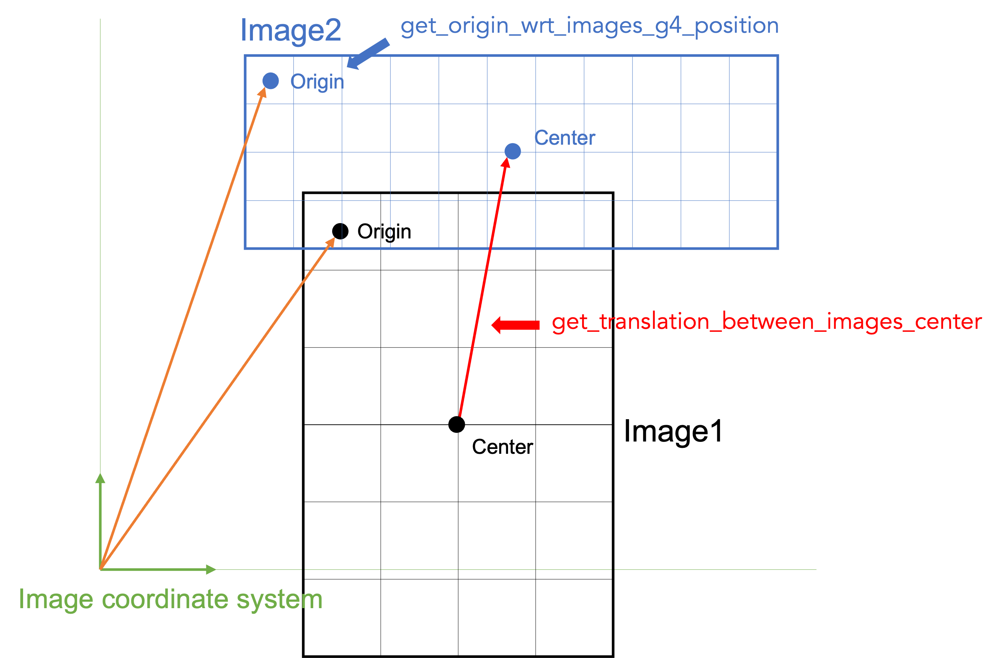

## Sources

Sources are the objects that create particles *ex nihilo*. The particles created from sources are called the *Event* in the Geant4 terminology, they got a *EventID* which is unique in a given *Run*.

Several sources can be defined and are managed at the same time. To add a source description to the simulation, you do:

```python
source1 = sim.add_source('Generic', 'MySource')
source1.n = 100

Bq = gam.g4_units('Bq')
source2 = sim.add_source('Voxels', 'MySecondSource')
source2.activity = 10 * Bq
```

There are several source types, each one with different parameter. In this example, `source1.n` indicates that this source will generate 10 Events. The second source manages the time and will generate 10 Events per second, so according to the simulation run timing, a different number of Events will be generated.

Information about the sources may be displayed with:

```python
# Print all types of source
print(sim.dump_source_types())

# Print information about all sources
print(sim.dump_sources())

# Print information about all sources after initialization
sim.initialize()
print(sim.dump_sources())
```

Note that the output will be different before or after initialization.

### Generic sources

The main type of source is called 'GenericSource' that can be used to describe a large range of simple source types. With 'GenericSource', user must describe 1) particle type, 2) position, 3) direction and 4) energy, see the following example:

```python
from scipy.spatial.transform import Rotation  # used for describe rotation matrix

MeV = gam.g4_units('MeV')
Bq = gam.g4_units('Bq')
source = sim.add_source('Generic', 'mysource')
source.mother = 'my_volume'
source.particle = 'proton'
source.activity = 10000 * Bq
source.position.type = 'box'
source.position.dimension = [4 * cm, 4 * cm, 4 * cm]
source.position.translation = [-3 * cm, -3 * cm, -3 * cm]
source.position.rotation = Rotation.from_euler('x', 45, degrees=True).as_matrix()
source.direction.type = 'iso'
source.energy.type = 'gauss'
source.energy.mono = 80 * MeV
source.energy.sigma_gauss = 1 * MeV
```

All parameters are stored into a dict like structure (a Box). Particle can be 'gamma', 'e+', 'e-', 'proton' (all Geant4 names). The number of particles that will be generated by the source can be described by an activity `source.activity = 10 MBq` or by a number of particle `source.n = 100`. The positions from were the particles will be generated are defined by a shape ('box', 'sphere', 'point', 'disc'), defined by several parameters ('size', 'radius') and orientation ('rotation', 'center'). The direction are defined with 'iso', 'momentum', 'focused'.
The energy can be defined by a single value ('mono') or Gaussian ('gauss').

The `mother` option indicate the coordinate system of the source. By default, it is the world, but it is possible to attach a source to any volume. In that case, the coordinate system of all emitted particles will follow the given volume.

It is possible to indicate a `angle_acceptance_volume` to the direction of a source. In that case, the particle will be created only if their position & direction make them intersect the given volume. This is for example useful for SPECT imaging in order to limit the particle creation to the ones that will have a chance to reach the detector. Note that the particles that will not intersect the volume will be created anyway but with a zero energy (so not tracked). This mechanism ensures to remain consistent with the required activity and timestamps of the particles, there is no need to scale with the solid angle. See for example `test028` test files for more details.

Source of ion can be set with the following (see `test013`)

```python
source1 = sim.add_source('Generic', 'ion1')
source1.particle = 'ion 9 18'  # Fluorine18
source2 = sim.add_source('Generic', 'ion2')
source2.particle = 'ion 53 124'  # Iodine 124
```

There is some predefined energy spectrum of positron (e+):

```python
source = sim.add_source('Generic', 'Default')
source.particle = 'e+'
source.energy.type = 'F18'  # F18 or O15 or C11 ...
```

It means the positrons will be generated following the (approximated) energy spectrum of the F18 ion. Source code is `GamSPSEneDistribution.cpp`. Energy spectrum for beta+ emitters are available : F18, Ga68, Zr89, Na22, C11, N13, O15, Rb82. See http://www.lnhb.fr/nuclear-data/module-lara. One example is available in `test031`. 


TODO : CONFINE option. 1) source volume MUST be larger than the volume it is confined.

2) no particle source in the daughters of the confine volume

All options have a default values and can be printed with `print(source)`.

### Voxelized sources

Voxelized sources can be described as follows:

```python
source = sim.add_source('Voxels', 'vox')
source.particle = 'e-'
source.activity = 4000 * Bq
source.image = 'an_activity_image.mhd'
source.direction.type = 'iso'
source.energy.mono = 100 * keV
source.mother = 'my_volume_name'
```

This code create a voxelized source. The 3D activity distribution is read from the given image. This image is internally normalized such that the sum of all pixels values is 1, leading to a 3D probability distribution. Particles will be randomly located somewhere in the image according to this probability distribution. Note that once an activity voxel is
chosen from this distribution, the location of the particle inside the voxel is performed uniformly. In the given example, 4 kBq of electrons of 140 keV will be generated.

Like all objects, by default, the source is located according to the coordinate system of its mother volume. For example, if the mother volume is a box, it will be the center of the box. If it is a voxelized volume (typically a CT image), it will the **center** of this image: the image own coordinate system (ITK's origin) is not considered here. If you want to align a voxelized activity with a CT image that have the same coordinate system you should compute the correct translation. This is done by the function  ```gam.get_translation_between_images_center```. See the contrib example ```dose_rate.py```. 




### GAN sources (Generative Adversarial Network)

linac spect pet

test034 : linac

test038 : spect

1) generate training dataset
2) train GAN 
3) use GAN as source ; compare to reference 


